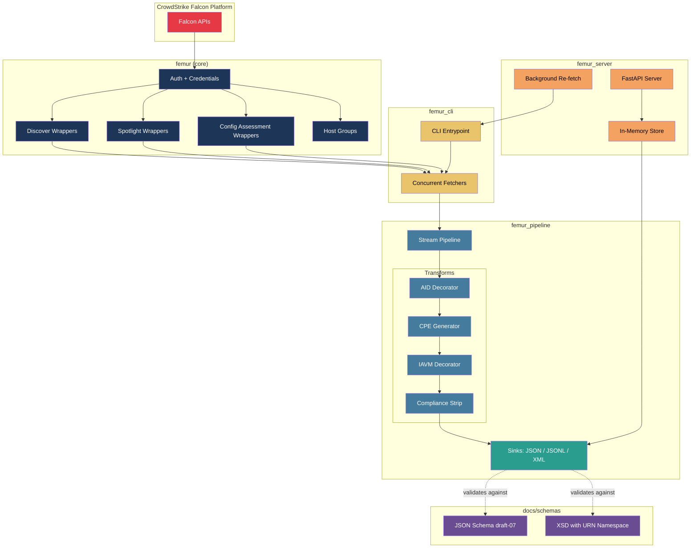

# Falcon Exposure Management Universal Reporter (FEMUR)

A monorepo of Python packages that concurrently fetch CrowdStrike Falcon exposure data (applications, vulnerabilities, configuration assessments, and host identity) and produce structured output files suitable for downstream compliance systems.

## What It Does

FEMUR pulls three complementary datasets from the CrowdStrike Falcon platform in parallel:

| Dataset | Falcon API | Purpose |
|---------|-----------|---------|
| Applications | Discover | Installed software inventory per host |
| Vulnerabilities | Spotlight | CVE findings with severity, remediation, and host context |
| Assessments | Configuration Assessment (SCA) | STIG/benchmark compliance findings per host |
| Host Map | Discover (hosts) | Resolves internal Discover host IDs to Falcon Agent IDs |

Output is written as monolithic JSON, streaming JSONL (bounded memory), or XML for SOAP ingestors.

## Example Run

```shell
$> femur -e crowdstrike.env \
    --output-format xml \
    --output-dir ./inventory-xml-by-sid \
    --bucket-by-aid \
    --app-large-env \
    --worker-by-severity \
    --assessment-large-env \
    --iavm-file ~/iavm/cvexref.xml \
    --decorate-aids

─────────────────────── CrowdStrike Falcon Exposure Management Universal Reporter ───────────────────────────────────────────

  Base URL                      US1
  Output                        femur_inventory.json
  Output format                 xml
  Output dir                    ./inventory-xml-by-sid
  Applications filter           (all)
  Applications mode             MAC-bucket parallel (16 threads)
  Application AID Enrichment    on (blocking pre-fetch)
  Assessments filter            created_timestamp:>='2000-01-01T00:00:00Z'
  Assessments facets            finding.rule
  Assessments mode              cross-bucket (30 threads)
  Vulnerabilities mode          severity buckets (5 parallel threads)

  ✓  Applications (173,365 records)      0:03:02
  ✓  Vulnerabilities (1,458,163 records) 0:11:06
  ✓  Assessments (300,376 records)       0:02:23
  ✓  Host Map (965 entries)              0:00:14

                Results
╭─────────────────┬───────────┬────────╮
│ Dataset         │   Records │ Status │
├─────────────────┼───────────┼────────┤
│ Applications    │   173,365 │   ✓    │
│ Vulnerabilities │ 1,458,163 │   ✓    │
│ Assessments     │   300,376 │   ✓    │
│ Host Map        │       965 │   ✓    │
╰─────────────────┴───────────┴────────╯

✓ Written to './inventory-xml-by-sid' (xml)
```

## Architecture



## Packages

| Package | pip name | Module | Description |
|---------|----------|--------|-------------|
| [core](packages/core/) | `falcon-exposure-management-universal-reporter` | `femur` | Higher-level wrappers around `crowdstrike-falconpy` for Discover, Spotlight, SCA, and Host Groups. Handles pagination, retry, FQL construction, and credential loading. |
| [pipeline](packages/pipeline/) | `femur-pipeline` | `femur_pipeline` | Streaming data pipeline with pluggable sinks (JSON, JSONL, XML) and record transforms (AID decoration, compliance mapping strip, field filtering). Zero external dependencies. |
| [cli](packages/cli/) | `femur-cli` | `femur_cli` | CLI tool (`femur`) that orchestrates concurrent fetches with Rich progress display and writes output to disk. Supports multiple fetch strategies for large environments. |
| [server](packages/server/) | `femur-server` | `femur_server` | ***OPTIONAL***: FastAPI REST server (`femurd`) that serves pre-fetched JSONL data over HTTP with pagination, filtering, and background re-fetch. |

### Dependency Graph

```
femur-cli ──────────────────┐
                            ├──▶ femur (core)
femur-server (optional) ────┤
                            └──▶ femur-pipeline
```

Both `femur-cli` and `femur-server` depend on `femur` (core) and `femur-pipeline`. The core and pipeline packages are independent of each other.

## Quick Start

### Prerequisites

- Python 3.10+
- CrowdStrike API credentials (`CLIENT_ID`, `CLIENT_SECRET`) with Discover, Spotlight, and SCA read scopes

### Install

```bash
# From the monorepo root (editable/development mode)
pip install -e packages/core
pip install -e packages/pipeline
pip install -e packages/cli
pip install -e packages/server
```

### Configure Credentials

Create an env file (e.g. `crowdstrike.env`):

```env
CLIENT_ID=your-client-id-here
CLIENT_SECRET=your-client-secret-here
BASE_URL=https://api.crowdstrike.com
```

### Run the CLI

```bash
# Basic fetch (monolithic JSON)
femur --env-file crowdstrike.env

# Streaming JSONL for large environments (bounded memory)
femur -e crowdstrike.env --output-format jsonl --output-dir ./inventory

# With parallel vulnerability fetch (faster for large envs)
femur -e crowdstrike.env --vuln-workers 8 --output-format jsonl --output-dir ./inventory

# Scope every dataset to host groups and/or grouping tags (additive to any FQL filter)
femur -e crowdstrike.env --host-groups "Production Servers,Development" --tags "Monkey,heartbeat"

# XML output for SOAP/CMRS ingestors
femur -e crowdstrike.env --output-format xml --output-dir ./inventory_xml
```

### Run the Server (OPTIONAL)

```bash
# Serve pre-fetched data over HTTP
femurd --data-dir ./inventory --env-file crowdstrike.env

# API docs at http://localhost:8000/docs
```

## Data Enrichment

The pipeline decorates records with additional context as they stream through:

| Transform | Dataset | Description |
|-----------|---------|-------------|
| CPE Generation | Applications | Generates CPE 2.3 URIs from vendor/product/version fields |
| IAVM Decoration | Vulnerabilities, Assessments | Maps CVE IDs to DISA IAVM notice metadata (number, severity, title) |
| AID Decoration | Applications | Resolves Discover host IDs to Falcon Agent IDs |

### CPE Generation

Every application record is automatically decorated with a `cpe` field containing a CPE 2.3 URI derived from the record's vendor, product, and version. Normalization includes vendor alias resolution (e.g. "Microsoft Corporation" → "microsoft"), product suffix stripping, and Linux package name cleanup.

```bash
# CPE decoration is always on
femur -e crowdstrike.env --output-format jsonl
```

Output:

```json
{"vendor": "Google", "name": "Chrome", "version": "120.0.1", "cpe": "cpe:2.3:a:google:chrome:120.0.1:*:*:*:*:*:*:*", "cpe_match_type": "generated"}
```

### IAVM Notice Decoration

When provided a DISA IAVM CVE cross-reference XML file, vulnerability records are decorated with matching IAVM notice metadata:

```bash
femur -e crowdstrike.env --iavm-file path/to/cvexref.xml --output-format jsonl
```

Output:

```json
{
  "vulnerability_id": "CVE-2024-0741",
  "status": "open",
  "iavm_notices": [
    {"iavm_number": "2024-T-0012", "iavm_severity": "CAT I", "iavm_title": "..."}
  ]
}
```

Records with no IAVM match are left unmodified (no empty field added).

## Large Environment Strategies

FEMUR includes several parallelism strategies for environments with hundreds of thousands of hosts:

| Flag | Strategy | Best For |
|------|----------|----------|
| `--large-env` | **Promoted recipe** — all strategies below + JSONL streaming + AID decoration | **Recommended starting point for big envs** |
| `--vuln-workers N` | Two-phase: scan IDs then fetch N-way parallel | >100k vulnerabilities |
| `--worker-by-severity` | Five parallel severity-bucket streams | Broad vulnerability distributions |
| `--app-large-env` | MAC-address OUI bucket parallelism (16 threads) | >200k applications |
| `--assessment-large-env` | Status x severity cross-product (30 threads) | >1M assessment findings |

The simplest way to run a large environment is the promoted `--large-env` flag, which
bundles the best-practice recipe (enables `--app-large-env`, `--worker-by-severity`,
`--assessment-large-env`; streams to JSONL for bounded memory unless you set
`--output-format` explicitly; and enables `--decorate-aids` unless `--skip-host-map`
is set):

```bash
femur -e crowdstrike.env --large-env --output-dir ./inventory
```

Add enrichment such as IAVM decoration on top as needed:

```bash
femur -e crowdstrike.env --large-env --output-dir ./inventory --iavm-file path/to/cvexref.xml
```

The individual strategy flags remain available if you want to tune them independently:

```bash
femur -e crowdstrike.env \
    --output-format jsonl \
    --output-dir ./inventory \
    --app-large-env \
    --worker-by-severity \
    --assessment-large-env \
    --iavm-file path/to/cvexref.xml \
    --decorate-aids
```

> **Note on partial results.** Under high concurrency the API can occasionally return
> a transient empty body (HTTP 204) or a burst of 5xx errors. FEMUR retries these with
> exponential back-off. If a streaming dataset still fails after retries, any records
> already written for it are **partial** — the run records the affected datasets under
> the `partial` and `errors` keys in `manifest.json`. Treat a partial dataset's count
> as a lower bound and re-run to obtain a complete dataset.

## Output Formats

| Format | Flag | Files | Memory | Use Case |
|--------|------|-------|--------|----------|
| JSON | `--output-format json` | Single `.json` | Unbounded | Small envs, quick inspection |
| JSONL | `--output-format jsonl` | Per-dataset `.jsonl` | Bounded | Large envs, `jq` pipelines |
| XML | `--output-format xml` | Per-dataset `.xml` | Bounded | SOAP/enterprise ingestors |

All output formats produce identical data structures. Schema definitions for validation and documentation are in [docs/schemas/](docs/schemas/) — JSON Schema (draft-07) for JSONL and XSD with URN-based `targetNamespace` identifiers for XML.

### Per-Host Bucketed Output

Use `--bucket-by-aid` to route records into per-AID subdirectories at write time. Each host gets its own directory with one file per dataset — no post-processing needed:

```bash
femur -e crowdstrike.env --bucket-by-aid --output-dir ./inventory
```

Files follow the naming convention `{dataset}--{cid}--{aid}--{epoch}.jsonl` where the epoch is the run start time (Unix seconds). This makes files self-describing and sortable:

```
inventory/by_aid/
    190a664e08e2488ca2fc49b19a3a29ae/
        vulnerabilities--5ddb0407bef2--190a664e08e2488ca2fc49b19a3a29ae--1780963200.jsonl
        applications--5ddb0407bef2--190a664e08e2488ca2fc49b19a3a29ae--1780963200.jsonl
        manifest--5ddb0407bef2--190a664e08e2488ca2fc49b19a3a29ae--1780963200.json
    eb083e8db5834b1aa60818dd91c606dd/
        vulnerabilities--7277b699df52--eb083e8db5834b1aa60818dd91c606dd--1780963200.jsonl
        manifest--7277b699df52--eb083e8db5834b1aa60818dd91c606dd--1780963200.json
    manifest.json
```

Each per-AID manifest includes record counts, provenance (app name, version, CLI command), and IAVM severity breakdown when `--iavm-file` is used. The aggregate `manifest.json` summarizes totals across all hosts.

This flag implies `--decorate-aids` (applications need the `aid` field populated from the host map). Supports multi-CID (Flight Control) environments — each AID's CID is captured from its records.

### Compression

Use `--compress` (or `--compressed`) to zip each output file individually after writing. Works with both flat and bucketed output, and any format (JSONL, XML). Manifest files stay uncompressed for discoverability.

```bash
# Flat output — each dataset file zipped individually
femur -e crowdstrike.env --output-format jsonl --compress --output-dir ./inventory
# Result: applications.jsonl.zip, vulnerabilities.jsonl.zip, manifest.json

# Bucketed output — per-AID files zipped in parallel
femur -e crowdstrike.env --bucket-by-aid --compress --output-dir ./inventory
```

Use `--compressed-by-aid` (with `--bucket-by-aid`) to zip each AID folder into a single archive:

```bash
femur -e crowdstrike.env --bucket-by-aid --compressed-by-aid --output-dir ./inventory
# Result: by_aid/190a664e08e2488ca2fc49b19a3a29ae.zip, manifest.json
```

Compression is parallelized across AIDs (up to 8 threads) for scale.

## Help

```shell
usage: femur [-h] [--env-file FILE] [--output FILE] [--output-format {json,jsonl,xml}] [--output-dir DIR] [--app-filter FQL]
             [--vuln-filter FQL] [--assessment-filter FQL] [--host-groups NAMES] [--tags TAGS] [--large-env] [--app-large-env]
             [--worker-by-severity] [--vuln-workers N] [--assessment-large-env] [--decorate-aids] [--iavm-file FILE]
             [--assessment-evidence] [--vuln-facet FACET] [--assessment-compliance-mapping | --no-assessment-compliance-mapping]
             [--skip-host-map] [--bucket-by-aid] [--compress] [--compressed-by-aid] [--indent N] [--verbose] [--log-file FILE]

Download CrowdStrike Falcon application inventory, vulnerabilities, and configuration assessment results to a single JSON file. All three datasets are fetched concurrently.

options:
  -h, --help            show this help message and exit

Credentials & Output:
  Where credentials come from and how/where results are written.

  --env-file FILE, -e FILE
                        Path to a .env file containing CLIENT_ID, CLIENT_SECRET, and optionally BASE_URL. Environment variables take priority over file values.
  --output FILE, -o FILE
                        Output JSON file path (default: femur_inventory.json).
  --output-format {json,jsonl,xml}
                        Output format. 'json' writes a single monolithic JSON file (the original behaviour, requires all data in memory). 'jsonl' writes one JSON-Lines
                        file per dataset with bounded memory (ideal for large environments + jq exploration). 'xml' writes one XML file per dataset for downstream SOAP
                        / enterprise ingestors. Note: --large-env selects 'jsonl' unless you set this explicitly. (default: json)
  --output-dir DIR      Directory for multi-file output formats (jsonl, xml). Created automatically if it does not exist. Ignored when --output-format=json. (default:
                        derived from --output filename)

Filtering & Scoping:
  Narrow each dataset with FQL, or scope every dataset by host group / tag.

  --app-filter FQL      FQL filter for the Discover applications query, e.g. "host.platform_name:'Windows'".
  --vuln-filter FQL     FQL filter for the Spotlight vulnerabilities query. Pass an empty string to use the library default. (default: "status:['open','reopen']")
  --assessment-filter FQL
                        FQL filter for the Configuration Assessment query, e.g. "finding.status:'fail'". (default: "created_timestamp:>='2000-01-01T00:00:00Z'")
  --host-groups NAMES   Comma-separated host group NAMES to scope every dataset to, e.g. "Production Servers,Development". Applied additively (AND) on top of
                        any --app/--vuln/--assessment-filter; multiple groups match with OR (a host in any listed group). Group names are resolved to IDs
                        automatically for the Spotlight and Configuration Assessment queries (requires the host-groups:read scope); Discover uses the names
                        directly. (default: none)
  --tags TAGS           Comma-separated host grouping TAGS to scope every dataset to, e.g. "Monkey,heartbeat". Applied additively (AND) on top of any filter;
                        multiple tags match with OR. A bare value is prefixed with "FalconGroupingTags/"; a value already containing a "prefix/" segment (e.g.
                        "SensorGroupingTags/web") is used as-is. (default: none)

Performance / Large Environments:
  Parallelism strategies for environments with hundreds of thousands of hosts. Start with --large-env.

  --large-env           Promoted convenience flag bundling the best-practice recipe for very large environments. Enables --app-large-env,
                        --worker-by-severity and --assessment-large-env; switches --output-format to 'jsonl' for bounded memory (unless
                        you set --output-format explicitly); and enables --decorate-aids (unless --skip-host-map is set). The recommended
                        starting point for environments with hundreds of thousands of hosts. (default: off)
  --app-large-env       Fetch applications using MAC-address first-octet bucket parallelism. Phase 0 probes all 256 two-char hex prefixes in parallel (~1-3s) to
                        discover non-empty OUI buckets (~20-50 in typical environments). Phase 1 runs one query_combined_applications cursor chain per bucket
                        concurrently (up to 16 threads). Wall-clock time is bounded by the largest single bucket rather than the sum. Measured speedup on a 333k-record
                        environment: ~3.4x (7:54 -> ~2:21). Cursor-based pagination within each bucket ensures no record duplication or omission. (default: off)
  --worker-by-severity  Fetch vulnerabilities using severity-level bucketing. Runs five parallel query_vulnerabilities_combined streams (CRITICAL, HIGH, MEDIUM, LOW,
                        and a catch-all), each with its own cursor chain. No two-phase ID scan — full records returned directly at up to 5,000 per page. Cannot be
                        combined with --vuln-workers > 1 (severity mode takes precedence). (default: off)
  --vuln-workers N      Number of parallel workers for the vulnerability fetch. When N > 1 a two-phase strategy is used: first collects all vulnerability IDs (fast),
                        then fetches full records in N concurrent threads. Recommended: 8. Raise cautiously — the API rate-limits at high concurrency. (default: 1)
  --assessment-large-env
                        Use a 30-thread status × severity cross-product strategy for assessments (finding.status × finding.rule.severity). Recommended for very large
                        environments where a single severity bucket in the default strategy would still be slow, e.g. millions of findings. Spawns up to 30 concurrent
                        cursor chains instead of the default 6. (default: off)

Data Enrichment:
  Decorate records with additional context as they are fetched.

  --decorate-aids       Annotate each application record with an "aid" field resolved from the host map (discover host ID → aid). Requires the host map to be present
                        (incompatible with --skip-host-map). Applications whose host ID cannot be resolved (e.g. agentless assets) are left unmodified. (default: off)
  --iavm-file FILE      Path to a DISA IAVM CVE cross-reference XML file. When provided, vulnerability and assessment records are decorated with matching IAVM notice
                        metadata (number, severity, title). (default: off)
  --assessment-evidence
                        Include evaluation logic (evidence) in each assessment finding. Adds the finding.evaluation_logic facet which returns the actual checks
                        performed on the host — registry keys, values observed, and pass/fail result per condition. Increases response payload size. (default: off)
  --vuln-facet FACET    Extra detail block(s) to request for vulnerabilities. Supported values: host_info, remediation, cve, evaluation_logic. Comma-separate multiple
                        values, e.g. "host_info,remediation,cve". Note: --vuln-workers > 1 always returns host_info, app and remediation.entities from the API
                        regardless of this setting. (default: none)
  --assessment-compliance-mapping, --no-assessment-compliance-mapping
                        Include compliance framework mappings (NIST, PCI DSS, SOC2, ISO, etc.) in each assessment finding rule. When disabled, the compliance_mappings
                        field is stripped from every finding.rule object, reducing output size. (default: on)

Host Map:
  Control the discover host ID → agent ID (aid) mapping fetch.

  --skip-host-map       Skip the discover host ID → aid mapping fetch. The output JSON will contain an empty "host_map" object. Use when you do not need to resolve
                        discover host IDs to agent IDs and want to reduce the number of API calls. (default: off)

Output Layout & Compression:
  How records are laid out on disk and whether output is compressed.

  --bucket-by-aid       Route output records to per-AID subdirectories. Each unique agent ID gets its own directory under <output-dir>/by_aid/ containing one file per
                        dataset. Enables per-host file discovery without post-processing. Implies --decorate-aids for applications. (default: off)
  --compress, --compressed
                        Zip each individual output file after writing. With --bucket-by-aid, zips per-AID files in parallel. Without --bucket-by-aid, zips the flat
                        output files (jsonl/xml). Originals are removed; manifest stays uncompressed for discoverability. (default: off)
  --compressed-by-aid   When used with --bucket-by-aid, zip each AID directory into a single archive (e.g. 190a664e08e2488ca2fc49b19a3a29ae.zip). The directory is
                        removed after archiving. Slower than --compress for selective access but produces fewer files. (default: off)
  --indent N            JSON indentation spaces. Use 0 for compact output (default: 2).

Logging:
  --verbose, -v         Enable verbose logging (DEBUG level). Shows full tracebacks on failures and HTTP traffic from the SDK.
  --log-file FILE       Write a timestamped plain-text log to FILE at DEBUG level in addition to the terminal output.

Examples:
  femur --env-file crowdstrike.env
  femur -e crowdstrike.env -o results.json --indent 0
  femur -e crowdstrike.env \
      --vuln-filter "cve.severity:'CRITICAL'+status:['open','reopen']" \
      --assessment-filter "finding.status:'fail'"
  femur -e crowdstrike.env --host-groups "Production Servers,Development" --tags "Monkey"

  # Large environment: one flag enables the full best-practice recipe
  femur -e crowdstrike.env --large-env --output-dir ./inventory
```

## Development

```bash
# Run full test suite
make test

# Run tests for a single package
make test-core
make test-pipeline
make test-cli
make test-server

# Lint
make lint

# Clean build artifacts
make clean
```

## Project Layout

```
falcon-exposure-management-universal-reporter/
├── bin/                    # Dev shims (femur, femurd)
├── cpe-mapper/            # CPE mapping subproject
├── packages/
│   ├── core/              # femur - API wrappers
│   ├── pipeline/          # femur_pipeline - streaming + sinks
│   ├── cli/               # femur_cli - CLI tool
│   └── server/            # femur_server - REST API server
├── design/                # Design documents
├── docs/
│   └── schemas/           # JSON Schema + XSD definitions for all output formats
├── reference/             # Reference materials
├── Makefile               # Build targets
├── pyproject.toml         # Workspace config
└── pytest.ini             # Test configuration
```

## License

MIT
