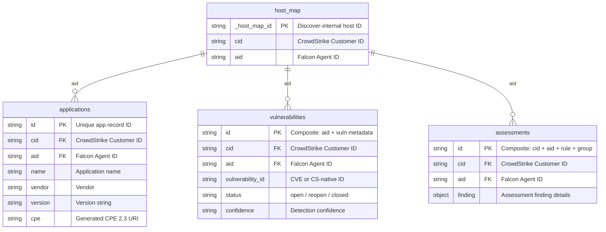
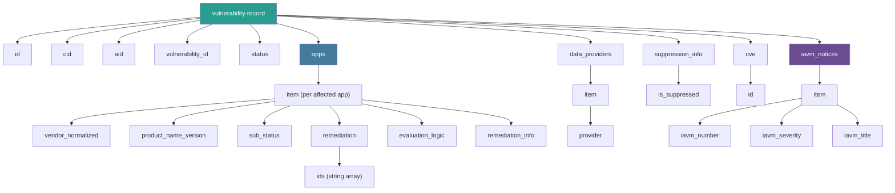
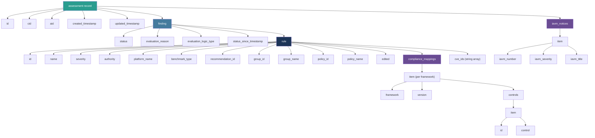

# Output Schemas

This directory contains schema definitions for all FEMUR output formats:

- **JSON Schema** (draft-07) — validates JSONL record files and JSON manifests
- **XSD** (XML Schema) — validates XML output files produced with `--output-format xml`

Both schema formats describe identical data structures. The XML output mirrors the
JSONL structure exactly — same fields, same nesting, same optional/required rules.

## Schema Index

### Data Records

Each schema describes a single dataset. For JSONL output, it validates one line.
For XML output, it validates the complete file (root element wrapping all records).

| Dataset | JSONL Schema | XSD Schema | Description |
| ------- | ------------ | ---------- | ----------- |
| applications | [applications.schema.json](applications.schema.json) | [applications.xsd](applications.xsd) | Software inventory from Falcon Discover |
| vulnerabilities | [vulnerabilities.schema.json](vulnerabilities.schema.json) | [vulnerabilities.xsd](vulnerabilities.xsd) | CVE/vulnerability findings from Spotlight |
| assessments | [assessments.schema.json](assessments.schema.json) | [assessments.xsd](assessments.xsd) | SCA/STIG configuration compliance findings |
| host_map | [host_map.schema.json](host_map.schema.json) | [host_map.xsd](host_map.xsd) | Discover host ID to Falcon Agent ID mapping |

### Manifests

| Context | JSONL Schema | XSD Schema | Description |
| ------- | ------------ | ---------- | ----------- |
| Flat output | [manifest.schema.json](manifest.schema.json) | [manifest.xsd](manifest.xsd) | Run metadata and record counts |
| Per-AID | [manifest-by-aid.schema.json](manifest-by-aid.schema.json) | [manifest-by-aid.xsd](manifest-by-aid.xsd) | Per-host metadata in bucketed output |
| Aggregate | [manifest-aggregate.schema.json](manifest-aggregate.schema.json) | [manifest-aggregate.xsd](manifest-aggregate.xsd) | Top-level index of all AID directories |

## Data Model

### Entity Relationships

The four data schemas share join keys (`cid`, `aid`) that link records across datasets.
The `host_map` resolves the Discover-internal host ID to the Falcon Agent ID used everywhere else.



### Record Hierarchy: Vulnerabilities



### Record Hierarchy: Assessments



## Output Modes

### Flat Output (default)

```text
output_dir/
    applications.{jsonl,xml}
    vulnerabilities.{jsonl,xml}
    assessments.{jsonl,xml}
    host_map.{jsonl,xml}
    manifest.{json,xml}
```

### Bucketed Output (`--bucket-by-aid`)

```text
output_dir/by_aid/
    manifest.{json,xml}                                        (aggregate)
    {aid}/
        applications--{cid_first12}--{aid}--{epoch}.{jsonl,xml}
        vulnerabilities--{cid_first12}--{aid}--{epoch}.{jsonl,xml}
        assessments--{cid_first12}--{aid}--{epoch}.{jsonl,xml}
        host_map--{cid_first12}--{aid}--{epoch}.{jsonl,xml}
        manifest--{cid_first12}--{aid}--{epoch}.{json,xml}     (per-AID)
```

File naming tokens:

- `{dataset}` — report type (applications, vulnerabilities, assessments, host_map, manifest)
- `{cid_first12}` — first 12 characters of the CrowdStrike Customer ID
- `{aid}` — full Falcon Agent ID
- `{epoch}` — Unix timestamp (seconds) of the run start time

## Optional Enrichments

Several fields are conditionally present depending on CLI flags:

### CPE Generation (always on)

Applies to: **applications** records.

| Field | Type | Description |
| ----- | ---- | ----------- |
| `cpe` | string | CPE 2.3 URI generated from vendor/product/version |
| `cpe_match_type` | string | Always `"generated"` (deterministic derivation) |

### AID Decoration (`--decorate-aids` or `--bucket-by-aid`)

Applies to: **applications** records.

| Field | Type | Description |
| ----- | ---- | ----------- |
| `aid` | string | Falcon Agent ID resolved from the host map |

### IAVM Notice Decoration (`--iavm-file`)

Applies to: **vulnerabilities** and **assessments** records (when CVE matches exist).

| Field | Type | Description |
| ----- | ---- | ----------- |
| `iavm_notices` | array | List of matching DISA IAVM notice metadata objects |
| `iavm_notices[].iavm_number` | string | IAVM notice number (e.g. `"2024-T-0012"`) |
| `iavm_notices[].iavm_severity` | string | DISA severity: `"CAT I"`, `"CAT II"`, or `"CAT III"` |
| `iavm_notices[].iavm_title` | string | IAVM notice title |

When IAVM is enabled, manifests also include:

| Field | Context | Description |
| ----- | ------- | ----------- |
| `iavm_date_generated` | All manifests | Date the IAVM XML source was generated |
| `iavm_summary` | Per-AID and aggregate manifests | Counts by severity category |
| `iavm_aids_affected` | Aggregate manifest only | Number of hosts with IAVM matches |

### Compliance Mappings (`--assessment-compliance-mapping`, default: on)

Applies to: **assessments** records.

| Field | Type | Description |
| ----- | ---- | ----------- |
| `finding.rule.compliance_mappings` | array | Framework mappings (NIST, PCI DSS, SOC2, ISO, HITRUST) |

Stripped when `--no-assessment-compliance-mapping` is used to reduce output size.

## XML Serialization Rules

The XML output is produced by `_dict_to_element()` in `xml_sink.py`:

- **Dict keys** become child element names
- **Arrays/lists** serialize as sequences of `<item>` child elements
- **Booleans** serialize as text `"true"` / `"false"`
- **None values** are omitted (element not present)
- **Tag names** have spaces replaced with underscores; digit-leading names get a `_` prefix

### XSD Extensibility

All XSD schemas use `xs:all` with `minOccurs="0"` for optional fields. The API may
add new fields in the future not yet defined in these schemas. Unknown elements will
cause validation failure — update the XSD when new fields appear in the output.

## Validation

### XML (xmllint)

```bash
# Flat output
xmllint --schema docs/schemas/applications.xsd output/applications.xml --noout
xmllint --schema docs/schemas/manifest.xsd output/manifest.xml --noout

# Bucketed output — single AID
xmllint --schema docs/schemas/vulnerabilities.xsd \
  output/by_aid/{aid}/vulnerabilities--{cid}--{aid}--{epoch}.xml --noout

# Bucketed output — aggregate manifest
xmllint --schema docs/schemas/manifest-aggregate.xsd output/by_aid/manifest.xml --noout

# Batch validate all per-AID manifests
find output/by_aid -name "manifest--*.xml" -exec \
  xmllint --schema docs/schemas/manifest-by-aid.xsd {} --noout \;
```

### JSONL (check-jsonschema)

```bash
# pip install check-jsonschema
cat output/applications.jsonl | while read -r line; do
  echo "$line" | check-jsonschema --schemafile docs/schemas/applications.schema.json -
done

# Or validate a manifest directly
ajv validate -s docs/schemas/manifest.schema.json -d output/manifest.json
```
